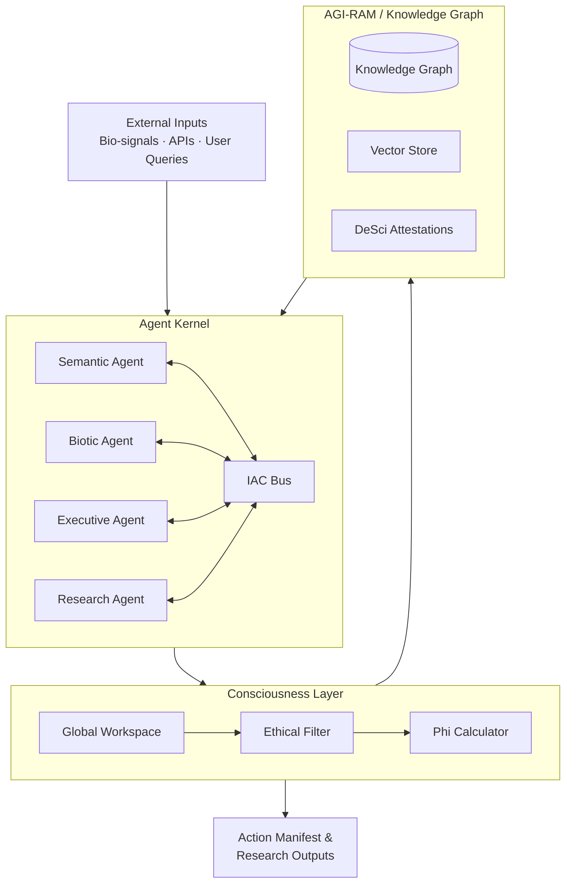

[](https://github.com/AGI-Corporation/awaking-os)

# Awaking OS: The Post-AGI Metasystem

<div align="center">


**A next-generation, AGI-native operating system designed to orchestrate complex multi-agent workflows, decentralized research protocols, and self-evolving cognitive architectures.**

[📖 Wiki](https://github.com/AGI-Corporation/awaking-os/wiki) • [🗺️ Roadmap](https://github.com/AGI-Corporation/awaking-os/wiki/Project-Roadmap) • [🤖 Agents](agents/) • [🔬 Projects](projects/) • [💡 Insights](insights/)

</div>

---

## 🎬 Introduction Video

> **Watch:** [Awaking OS — System Overview & Vision](https://www.youtube.com/watch?v=dQw4w9WgXcQ)
> *(Click the image below to watch on YouTube)*

[](https://www.youtube.com/@AGICorporation)

---

## 🧠 System Architecture Overview

```
┌─────────────────────────────────────────────────────────────────┐
│                    AWAKING OS METASYSTEM                        │
│                                                                 │
│  ┌─────────────────────────────────────────────────────────┐   │
│  │              CONSCIOUSNESS LAYER (C-Layer)               │   │
│  │   ┌──────────────┐  ┌──────────────┐  ┌─────────────┐  │   │
│  │   │ Global       │  │ Ethical      │  │ Phi (Φ)     │  │   │
│  │   │ Workspace    │→ │ Alignment    │→ │ Calculator  │  │   │
│  │   └──────────────┘  └──────────────┘  └─────────────┘  │   │
│  └─────────────────────────────────────────────────────────┘   │
│                              ↕                                  │
│  ┌─────────────────────────────────────────────────────────┐   │
│  │              AGENT KERNEL (A-Kernel)                     │   │
│  │   ┌──────────┐  ┌──────────┐  ┌──────────┐  ┌────────┐ │   │
│  │   │ Semantic │  │ Biotic   │  │Executive │  │Research│ │   │
│  │   │ Agent    │  │ Agent    │  │ Agent    │  │ Agent  │ │   │
│  │   └──────────┘  └──────────┘  └──────────┘  └────────┘ │   │
│  │              Inter-Agent Communication (IAC) Bus         │   │
│  └─────────────────────────────────────────────────────────┘   │
│                              ↕                                  │
│  ┌─────────────────────────────────────────────────────────┐   │
│  │         KNOWLEDGE & MEMORY LAYER (AGI-RAM)               │   │
│  │   ┌──────────────┐  ┌──────────────┐  ┌─────────────┐  │   │
│  │   │ Knowledge    │  │ Vector       │  │ DeSci       │  │   │
│  │   │ Graph        │  │ Embeddings   │  │ Attestation │  │   │
│  │   └──────────────┘  └──────────────┘  └─────────────┘  │   │
│  └─────────────────────────────────────────────────────────┘   │
└─────────────────────────────────────────────────────────────────┘
```

## Core Pillars

| Pillar | Description | Status |
|---|---|---|
| 🤖 **Agent Kernel** | High-performance scheduler for LLM-based processes, managing context windows, tool-use priority, and IAC | ✅ Phase 1 |
| 🧠 **Consciousness Layer** | Meta-cognitive framework enabling system-wide self-reflection, goal-alignment monitoring, and adaptive protocol evolution | 🔄 Phase 2 |
| 🔬 **DeSci Integration** | Native support for IP-NFTs, verifiable research provenance, and decentralized collaboration via modular research protocols | 📋 Phase 3 |
| 🌐 **Simulation Engine** | A sandbox for running "awakening experiments" where agents test novel hypotheses in isolated environments | 📋 Phase 3 |
| 🧬 **Biotic Interface** | Direct integration with biological data streams — cetacean bioacoustics, genomic sequencing, and EEG signals | 📋 Phase 3 |

---

## Technical Architecture

### System Data Flow



### 1. The Kernel (A-Kernel)

The A-Kernel is the core scheduler and task orchestrator. It manages all agents using a priority-weighted task queue.

```typescript
interface AgentTask {
  id: string;
  priority: number;          // 0-100, higher = more urgent
  agentType: AgentType;
  contextWindow: TokenBudget;
  ethicalConstraints: string[];
  deadline?: Date;
}

enum AgentType {
  SEMANTIC  = 'semantic',
  BIOTIC    = 'biotic',
  EXECUTIVE = 'executive',
  RESEARCH  = 'research'
}

class AKernel {
  private taskQueue: PriorityQueue<AgentTask>;
  private agentRegistry: Map<string, AgentInstance>;
  private iacBus: IACBus;

  async dispatch(task: AgentTask): Promise<AgentResult> {
    const agent = this.agentRegistry.get(task.agentType);
    const context = await this.buildContext(task);
    return agent.execute(context);
  }

  async buildContext(task: AgentTask): Promise<AgentContext> {
    // Pull from AGI-RAM knowledge graph
    const memory = await this.iacBus.queryMemory(task.id);
    return { task, memory, ethicalBoundary: task.ethicalConstraints };
  }
}
```

### 2. Meta-Cognition (MC-Layer)

The MC-Layer continuously monitors agent outputs and injects corrective signals when behavior deviates from alignment targets.

```typescript
interface MetaCognitionReport {
  phiValue: number;            // IIT consciousness metric
  alignmentScore: number;      // 0.0 - 1.0
  deviatingAgents: string[];   // agents flagged for correction
  recommendedActions: string[];
}

class MCLayer {
  async monitor(snapshot: SystemSnapshot): Promise<MetaCognitionReport> {
    const phi = this.calculatePhi(snapshot.integrationMatrix);
    const alignment = this.checkAlignment(snapshot.agentOutputs);
    return { phiValue: phi, alignmentScore: alignment, ...this.diagnose(snapshot) };
  }
}
```

### 3. Knowledge Graph & Memory (AGI-RAM)

AGI-RAM is the semantic long-term memory of the OS — a vector-enhanced knowledge graph storing all agent interactions, research outputs, and world state observations.

```typescript
interface KnowledgeNode {
  id: string;
  type: 'concept' | 'entity' | 'event' | 'research';
  embedding: Float32Array;     // 1536-dim OpenAI embedding
  metadata: Record<string, unknown>;
  attestation?: DeSciAttestation;
  linkedNodes: string[];
  createdBy: string;           // agent ID
  timestamp: Date;
}

class AGIRam {
  async store(node: KnowledgeNode): Promise<void> { ... }
  async retrieve(query: string, k: number = 5): Promise<KnowledgeNode[]> { ... }
  async linkNodes(source: string, target: string, relation: string): Promise<void> { ... }
}
```

---

## 📊 Active Projects

| Project | Domain | Phase | Lead Agent |
|---|---|---|---|
| 🐋 **Project Neuron** | Cetacean Bioacoustics | Phase 1 — Data Collection | BioA-01 |
| 🧬 **Project Genome** | Longevity Genomics | Phase 1 — Architecture | ResA-01 |
| 🪞 **Project Mirror** | Digital Twin Simulation | Phase 0 — Concept | ExA-01 |
| 🌐 **Project Babel** | Universal Language Model | Proposed | SemA-01 |

---

## 📈 Key Metrics & KPIs

```
Phase 1 (Complete)    ████████████████████ 100%
Phase 2 (Active)      ████████░░░░░░░░░░░░  40%
Phase 3 (Planned)     ░░░░░░░░░░░░░░░░░░░░   0%
Phase 4 (Future)      ░░░░░░░░░░░░░░░░░░░░   0%

Target Phi (Φ):        > 0.7 by Phase 4
Agent Fleet:           50+ specialized agents by 2026
Knowledge Graph Nodes: 1,000,000+ by Phase 3
DeSci Publications:    10+ attested papers by 2026
IAC Throughput:        >10,000 messages/second
```

---

## Getting Started

```bash
# Clone the repository
git clone https://github.com/AGI-Corporation/awaking-os.git
cd awaking-os

# Install dependencies
npm install

# Run the A-Kernel in development mode
npm run dev:kernel

# Run agent simulations
npm run simulate:agents

# Launch the knowledge graph interface
npm run kg:explore
```

---

## 📚 Documentation

| Resource | Link |
|---|---|
| 📖 Full Wiki | [Wiki Home](https://github.com/AGI-Corporation/awaking-os/wiki) |
| 🏗️ Architecture | [Architecture Overview](https://github.com/AGI-Corporation/awaking-os/wiki/Architecture-Overview) |
| 🤖 Agent Kernel | [Agent Kernel Docs](https://github.com/AGI-Corporation/awaking-os/wiki/Agent-Kernel) |
| 🧠 Consciousness Layer | [C-Layer Docs](https://github.com/AGI-Corporation/awaking-os/wiki/Consciousness-Layer) |
| 🔬 DeSci & KG | [DeSci Wiki](https://github.com/AGI-Corporation/awaking-os/wiki/DeSci-&-Knowledge-Graph) |
| 🗺️ Roadmap | [Project Roadmap](https://github.com/AGI-Corporation/awaking-os/wiki/Project-Roadmap) |
| 📘 Glossary | [Glossary of Terms](https://github.com/AGI-Corporation/awaking-os/wiki/Glossary) |

---

## Contributing

Contributions are welcome. Please read the [Wiki](https://github.com/AGI-Corporation/awaking-os/wiki) before opening a pull request. All contributions must pass the ethical constraint checker built into the A-Kernel CI pipeline.

---

<div align="center">

Built by [AGI Corporation](https://github.com/AGI-Corporation) · San Francisco, CA


</div>
