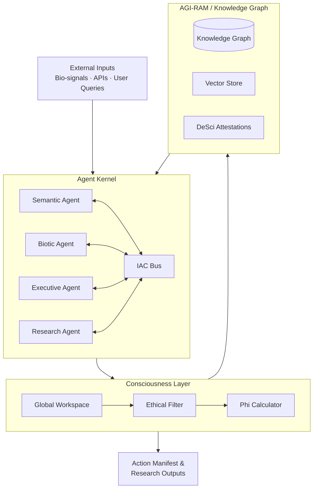

[](https://github.com/AGI-Corporation/awaking-os)

# Awaking OS: The Post-AGI Metasystem

<div align="center">


**An AGI-native runtime for orchestrating multi-agent workflows, semantic memory, and meta-cognitive monitoring — implemented in Python.**

[📖 Plan](./PLAN.md) • [🤖 Agents](./awaking_os/agents/) • [🧠 Consciousness Layer](./awaking_os/consciousness/) • [🔬 Examples](./examples/)

</div>

---

## 🧠 System Architecture Overview

```
┌─────────────────────────────────────────────────────────────────┐
│                    AWAKING OS METASYSTEM                        │
│                                                                 │
│  ┌─────────────────────────────────────────────────────────┐   │
│  │              CONSCIOUSNESS LAYER (C-Layer)               │   │
│  │   ┌──────────────┐  ┌──────────────┐  ┌─────────────┐  │   │
│  │   │ Global       │  │ Ethical      │  │ Phi (Φ)     │  │   │
│  │   │ Workspace    │→ │ Filter       │→ │ Calculator  │  │   │
│  │   └──────────────┘  └──────────────┘  └─────────────┘  │   │
│  └─────────────────────────────────────────────────────────┘   │
│                              ↕                                  │
│  ┌─────────────────────────────────────────────────────────┐   │
│  │              AGENT KERNEL (A-Kernel)                     │   │
│  │   ┌──────────┐  ┌──────────┐  ┌──────────┐  ┌────────┐ │   │
│  │   │ Semantic │  │ Biotic   │  │Executive │  │Research│ │   │
│  │   │ Agent    │  │ Agent    │  │ Agent    │  │ Agent  │ │   │
│  │   └──────────┘  └──────────┘  └──────────┘  └────────┘ │   │
│  │              Inter-Agent Communication (IAC) Bus         │   │
│  └─────────────────────────────────────────────────────────┘   │
│                              ↕                                  │
│  ┌─────────────────────────────────────────────────────────┐   │
│  │         KNOWLEDGE & MEMORY LAYER (AGI-RAM)               │   │
│  │   ┌──────────────┐  ┌──────────────┐  ┌─────────────┐  │   │
│  │   │ Knowledge    │  │ Vector       │  │ DeSci       │  │   │
│  │   │ Graph        │  │ Embeddings   │  │ Attestation │  │   │
│  │   └──────────────┘  └──────────────┘  └─────────────┘  │   │
│  └─────────────────────────────────────────────────────────┘   │
└─────────────────────────────────────────────────────────────────┘
```

## Core Pillars

| Pillar | Module | Status |
|---|---|---|
| 🤖 **Agent Kernel** | `awaking_os.kernel` | ✅ Implemented |
| 🧠 **Consciousness Layer** | `awaking_os.consciousness` | ✅ Implemented |
| 🧬 **Memory + DeSci** | `awaking_os.memory` (Chroma + ed25519) | ✅ Implemented (DeSci is a local-signing stub) |
| 🌐 **Bio I/O + External APIs** | `awaking_os.io` (mock streams + FFT/k-mer features + token-bucket gateway) | ✅ Implemented |
| 🧪 **Simulation Engine** | `awaking_os.simulation` (Sandbox + Hypothesis/Expectation evaluator) | ✅ Implemented |

---

## Technical Architecture

### System Data Flow



### 1. The Kernel (A-Kernel)

The A-Kernel is the core scheduler. Tasks are submitted, queued by priority, and dispatched to a registered agent. After every dispatch, the kernel publishes the result on the `kernel.result` topic and (when wired) emits a meta-cognition report on `mc.report`.

```python
import asyncio

from awaking_os.types import AgentType
from awaking_os.kernel import AKernel, AgentRegistry, IACBus
from awaking_os.kernel.task import AgentTask


async def main() -> None:
    bus = IACBus()
    registry = AgentRegistry()
    # ... registry.register(some_agent) ...
    kernel = AKernel(registry=registry, bus=bus, agi_ram=agi_ram)

    kernel.start()                       # spawns the dispatch loop
    await kernel.submit(
        AgentTask(
            id="task-001",
            priority=80,                  # 0–100, higher = sooner
            agent_type=AgentType.SEMANTIC,
            payload={"q": "What is integrated information?"},
            ethical_constraints=["no_personal_data"],
        )
    )


asyncio.run(main())
```

Internally, `AKernel.dispatch()` looks up the agent for the task type, builds an `AgentContext` (pulling relevant memory through the bus), executes with a timeout, and returns an `AgentResult`.

### 2. Meta-Cognition (MC-Layer)

The MC-Layer monitors agent outputs after every dispatch. It computes a Φ value (entropy of the spectrum of the integration matrix — a tractable IIT proxy, not full PyPhi), evaluates each output against a rule-based ethical filter, and surfaces salient nodes from the Global Workspace.

```python
from awaking_os.consciousness import (
    EthicalFilter, GlobalWorkspace, MCLayer, PhiCalculator,
)

mc_layer = MCLayer(
    phi_calculator=PhiCalculator(),
    ethical_filter=EthicalFilter(),     # 6 default rules; severity → alignment
    global_workspace=GlobalWorkspace(),
    alignment_threshold=0.5,
)
kernel = AKernel(registry=registry, bus=bus, agi_ram=agi_ram, mc_layer=mc_layer)
```

Each `MetaCognitionReport` carries `phi_value`, `alignment_score` (0.0–1.0), `deviating_agents`, `triggered_rules`, `recommended_actions`, and `salient_node_ids`.

### 3. Knowledge Graph & Memory (AGI-RAM)

AGI-RAM is the system's long-term semantic memory: a `KnowledgeNode` graph (NetworkX, optionally sqlite-snapshotted) + a vector store (Chroma or in-memory) + optional ed25519 DeSci attestation. `store()` auto-embeds and auto-signs; `retrieve()` runs semantic similarity when embeddings are wired and falls back to keyword overlap otherwise.

```python
from awaking_os.memory import (
    AGIRam, ChromaVectorStore, DeSciSigner, FakeEmbeddingProvider,
    KnowledgeNode,
)

agi_ram = AGIRam(
    db_path="./data/agi.sqlite",
    vector_store=ChromaVectorStore(persist_path="./data/chroma"),
    embedding_provider=FakeEmbeddingProvider(),     # or SentenceTransformer
    signer=DeSciSigner(),                           # optional ed25519 attestation
)

node_id = await agi_ram.store(
    KnowledgeNode(type="research", content="Phi rises with integration.", created_by="seed")
)
hits = await agi_ram.retrieve("integration", k=5)
```

---

## 📊 Active Projects

| Project | Domain | Backing Agent / Module |
|---|---|---|
| 🐋 **Project Neuron** | Cetacean Bioacoustics | `BioticAgent` (`signal_type=cetacean`) — `awaking_os.io.bio_signals` |
| 🧬 **Project Genome** | Longevity Genomics | `BioticAgent` (`signal_type=genomic`) — GC-content + base counts |
| 🪞 **Project Mirror** | Digital Twin Simulation | `Sandbox` from `awaking_os.simulation` runs isolated experiments + `ExecutiveAgent` decomposition |
| 🌐 **Project Babel** | Universal Language Model | `SemanticAgent` + `agares` / `paimon` personas |

---

## 📈 Key Metrics & KPIs

```text
Foundation (kernel, bus, memory):    ████████████████████ 100%
Embeddings + Vector Store + DeSci:   ████████████████████ 100%
Agents (Semantic, Biotic, Exec, Research): ████████████████████ 100%
Consciousness Layer (Phi, Ethics, GW, MC): ████████████████████ 100%
Bio-signal feature extraction:        ████████████████████ 100%
Simulation engine (Sandbox + Hypothesis): ████████████████████ 100%
Min-cut Phi (exact for n ≤ 6):        ████████████████████ 100%
Sqlite LLM response cache:            ████████████████████ 100%
On-chain DeSci publication (local JSONL): ████████████████████ 100%
Persistent task queue + recovery:     ████████████████████ 100%
Cleanup + Docs:                       ████████████████████ 100%
Live bio-signal hardware:             ░░░░░░░░░░░░░░░░░░░░   0%
On-chain mainnet publication:         ░░░░░░░░░░░░░░░░░░░░   0%

Tests:                343 passing (96% line coverage)
IAC Bus:              asyncio pub/sub, multi-subscriber
Knowledge Graph:      NetworkX + sqlite snapshot, atomic store rollback
Vector Store:         Chroma (cosine) or in-memory numpy
Bio-signal features:  FFT (dominant freq, spectral entropy, band powers)
                      + dinucleotide k-mer counts + entropy
Simulation engine:    Sandbox provisions ephemeral kernel + agents per
                      experiment; Hypothesis/Expectation evaluator
Phi calculators:      Spectral entropy (any N) + exact min-cut (n ≤ 6,
                      brute-force bipartitions); both drop into MCLayer
LLM:                  Anthropic claude-opus-4-7 (with prompt caching) or
                      Fake; CachingLLMProvider memoizes responses to a
                      sqlite cache (keyed by system + messages + max_tokens
                      + model, optional TTL); LLMEthicalGrader plugs into
                      the EthicalFilter via min-combine for an LLM-backed
                      alignment scorer that rules-floor can't be exceeded
DeSci publication:    LocalJSONLPublisher gives every attestation real
                      chain semantics — sequential block_height,
                      content-addressed tx_hash, prev_hash linkage. Tamper
                      with any block and verify_chain() returns False.
                      OnChainPublisher ABC means a real-chain backend
                      (Ethereum / Polygon) drops in without touching AGIRam.
Task queue:           InMemoryTaskQueue (default, asyncio.PriorityQueue)
                      or PersistentTaskQueue (sqlite-backed, durable
                      across restarts, recovers in-progress tasks with
                      attempt_count + max_attempts cap, audit history of
                      every completed task). Both implement TaskQueue ABC;
                      kernel takes either via task_queue= kwarg.
```

> **Wiki note (2026-05-02):** the GitHub wiki at
> [`/wiki`](https://github.com/AGI-Corporation/awaking-os/wiki) still references
> the deleted esoteric modules (Lemegeton Engine, Planetary Pentacles,
> Somatic Recombination). The code in this repo is authoritative; the wiki
> needs to be cleaned up by a maintainer with wiki-repo write access.

---

## Getting Started

```bash
# Clone and install
git clone https://github.com/AGI-Corporation/awaking-os.git
cd awaking-os
pip install -e ".[dev]"

# Run the test suite
pytest

# Submit a task — uses FakeLLMProvider unless ANTHROPIC_API_KEY is set
awaking-os submit --type semantic --payload '{"q": "What is Phi?"}'

# Force the deterministic fake LLM (no API key needed)
awaking-os submit --type biotic --payload '{"signal_type": "genomic", "samples": 500}' --fake-llm

# Decompose a goal into research + semantic sub-tasks
awaking-os submit --type executive --payload '{"goal": "investigate cetacean signaling"}'

# Specialize an agent with a persona
awaking-os submit --type semantic --payload '{"q": "How vulnerable is X?", "persona": "vine"}'

# Print the version
awaking-os version

# Run the end-to-end demo (no API key needed)
python examples/awaking_demo.py

# Run the simulation-engine demo — three isolated experiments with hypothesis evaluation
python examples/experiment_demo.py
```

For a real LLM, set `ANTHROPIC_API_KEY` (the CLI will pick it up automatically). To use sentence-transformer embeddings instead of the deterministic fake, install the `ml` extra: `pip install -e ".[dev,ml]"`.

### Optional CLI env knobs

| Env var | Effect |
|---|---|
| `ANTHROPIC_API_KEY` | When set, the CLI uses `AnthropicProvider` (`claude-opus-4-7`); otherwise falls back to `FakeLLMProvider`. |
| `AWAKING_LLM_CACHE_DB=/path/to/cache.sqlite` | Wraps the LLM with `CachingLLMProvider`. Identical prompts return memoized responses; complements Anthropic's prompt caching. |
| `AWAKING_LLM_CACHE_TTL=3600` | TTL in seconds for cached responses (only active when `AWAKING_LLM_CACHE_DB` is set). |
| `AWAKING_LLM_GRADER=1` | Adds an LLM-backed alignment grader to the `EthicalFilter`. The filter combines the LLM score with the rule-based score via `min` — an LLM can never make alignment look better than the rules say, only worse. |
| `AWAKING_DATA_DIR=/path` | Where AGI-RAM persists the knowledge-graph sqlite (default `.awaking`). |

---

## 📚 Documentation

| Resource | Link |
|---|---|
| 📖 Implementation Plan | [PLAN.md](./PLAN.md) |
| 🤖 Agents | [`awaking_os/agents/`](./awaking_os/agents/) |
| 🧠 Consciousness Layer | [`awaking_os/consciousness/`](./awaking_os/consciousness/) |
| 🧬 Memory (AGI-RAM) | [`awaking_os/memory/`](./awaking_os/memory/) |
| 🔌 LLM Providers | [`awaking_os/llm/`](./awaking_os/llm/) |
| 📡 I/O (bio-signals, external APIs) | [`awaking_os/io/`](./awaking_os/io/) |
| 🔬 Examples | [`examples/`](./examples/) |
| 🧪 Tests | [`tests/`](./tests/) |

---

## Contributing

Contributions are welcome. Please ensure `pytest` passes and `ruff check` + `ruff format --check` are clean before opening a pull request. CI runs on Python 3.11 and 3.12 (see `.github/workflows/ci.yml`).

---

<div align="center">

Built by [AGI Corporation](https://github.com/AGI-Corporation) · San Francisco, CA


</div>
