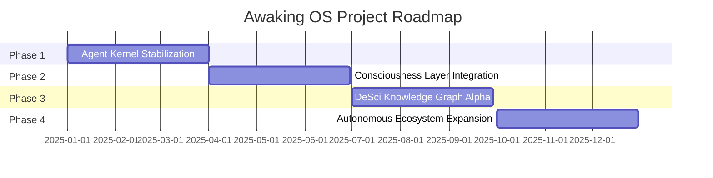

# Projects

This directory catalogs all active and proposed research and development projects within the Awaking OS ecosystem.

## Active Projects

### Project Neuron
**Status:** Active | **Phase:** 1 - Data Collection
- Goal: Map the bioacoustic communication patterns of cetaceans.
- Agents involved: Biotic Agent (BioA-01), Semantic Agent (SemA-03).
- Deliverable: A labeled dataset of 100,000+ cetacean sound events.

### Project Genome
**Status:** Active | **Phase:** 1 - Architecture Design
- Goal: Secure integration of personal genomic data for longevity research.
- Agents involved: Research Agent (ResA-01), Executive Agent (ExA-01).
- Deliverable: A privacy-preserving genomic data pipeline using Compute-to-Data.

### Project Mirror
**Status:** Proposed | **Phase:** 0 - Concept
- Goal: Build a digital twin of the Awaking OS consciousness for simulation.
- Deliverable: A sandboxed simulation environment for testing ethical alignment.

## Roadmap

## Completed Projects

| Project | Outcome | Date |
|---|---|---|
| README Scaffold | Deep technical README created | 2025-Q1 |
| Wiki Foundation | Multi-page wiki with diagrams | 2025-Q1 |
